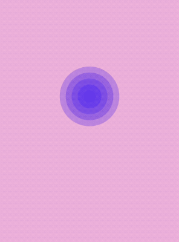

<p align="center">
    
</p>

**Ease** is a event driven animation system that combines the observer pattern with custom spring animations as observers.




## How

Create your **Ease** object with an initial value

```swift
var ease = Ease(initialValue: view.center)
```

Add your custom spring-animation(s)

```swift
ease.addSpring(tension: 300, damping: 15, mass: 1) { position in
    view.center = position
}
```

Set the target value of your Ease object and adjust your target as often as you want

```swift
ease.targetValue = gestureRecognizer.location(in: view)
```

## Memory management

For a single spring-animation you can store the returned `EaseDisposable` to a variable

```swift
disposable = ease.addSpring(tension...

```

For multiple spring-animations you can add the disposable to a `EaseDisposal` variable

```swift
ease.addSpring(tension...) { }.add(to: &disposal)
```

And always weakify `self` when referencing `self` inside your spring-animation

```swift
ease.addSpring(tension...) { [weak self] position in
```

## Installation

Ease is available through [CocoaPods](http://cocoapods.org). To install
it, simply add the following line to your Podfile:

```ruby
pod 'Ease'
```

## Suggestions or feedback?

Feel free to create a pull request, open an issue or find [me on Twitter](https://twitter.com/roberthein).
